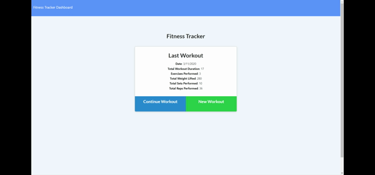

# Workout Tracker
Unit 17 Nosql Homework: Workout Tracker

This is a Node.js, Express server and MongoDB application that users can track their fitness goals and progress. 

The user be able to:

  * Add exercises to a previous workout plan.

  * Add new exercises to a new workout plan.

  * View multiple the combined weight of multiple exercises on the `stats` page.

Heroku hosting path is as below:
https://evening-lowlands-77290.herokuapp.com/

